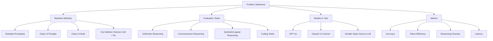
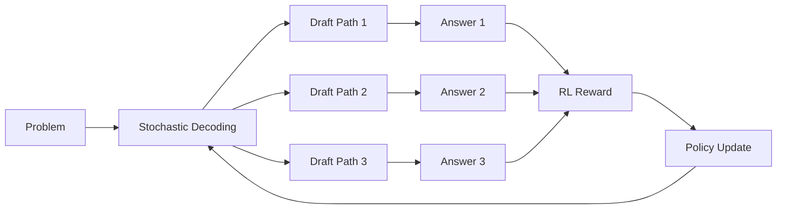
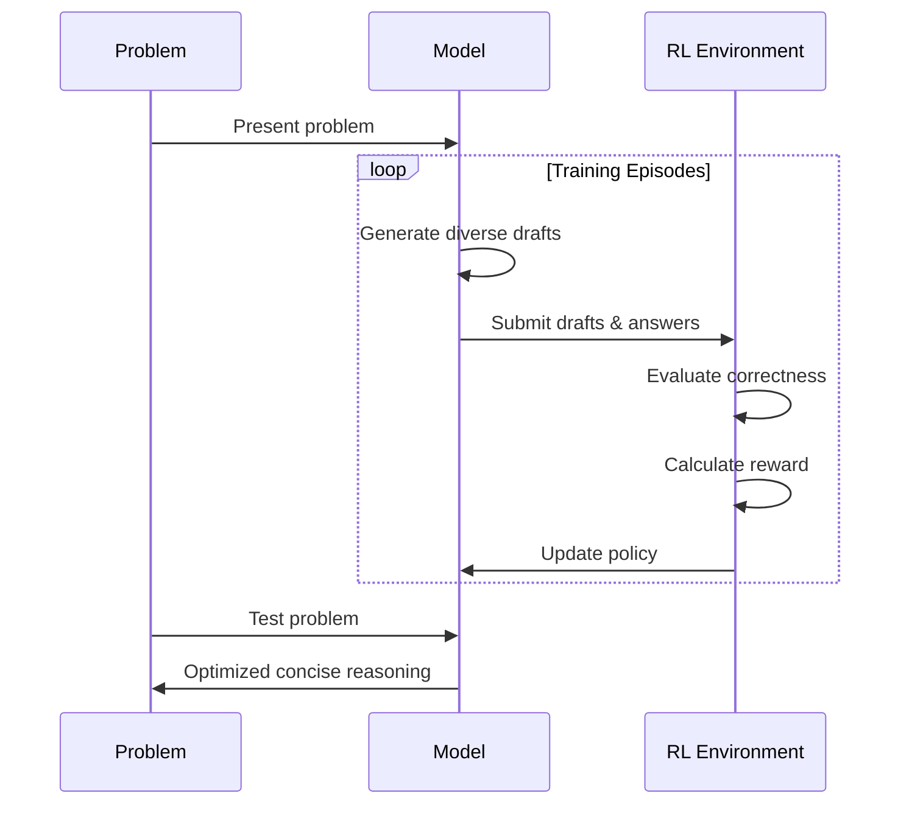

# Enhancing LLM Reasoning: Chain of Draft with Semantically Diverse Thinking Tokens

## The Challenge: Efficient Reasoning in LLMs

Large Language Models (LLMs) have become remarkably capable at complex reasoning tasks, but this often comes at a cost: verbose outputs that consume significant computational resources. The Chain of Thought (CoT) prompting technique, while effective for accuracy, generates lengthy reasoning steps that increase token usage and latency.

Enter Chain of Draft (CoD), a promising alternative introduced by Xu et al. (2025) that encourages LLMs to produce concise, minimalistic reasoning steps. CoD has shown impressive results, matching or exceeding CoT accuracy while using as little as 7.6% of the tokens.

But could we make this approach even better?

## Our Hypothesis

We hypothesize that by introducing **semantically diverse token sampling** into the CoD process and optimizing it through **reinforcement learning (RL)**, we could create a reasoning system that:

1. Maintains the token efficiency of CoD
2. Matches or exceeds the accuracy of CoT
3. Explores multiple reasoning paths to find optimal solutions

In other words: Can we make LLMs think both broadly (exploring different approaches) and efficiently (through concise drafting)?

## Proposed Experimental Design



### Baseline Methods

We plan to compare four different prompting strategies:

1. **Standard Prompting**: Direct answer without explicit reasoning
2. **Chain of Thought (CoT)**: Detailed step-by-step reasoning
3. **Chain of Draft (CoD)**: Concise intermediate reasoning steps
4. **Our Method (Diverse CoD + RL)**: Enhanced CoD with diverse token sampling and RL optimization

### Reasoning Tasks

To thoroughly evaluate our approach, we'll test it on diverse reasoning tasks:

- **Arithmetic Reasoning**: GSM8K math word problems
- **Commonsense Reasoning**: Date understanding and sports understanding from BIG-Bench
- **Symbolic/Logical Reasoning**: Coin-flip puzzles and logical transformations
- **Coding Tasks**: HumanEval programming challenges

### Models to Evaluate

We'll test our approach on multiple LLMs to assess generalizability:

- GPT-4o (OpenAI)
- Claude 3.5 Sonnet (Anthropic)
- A smaller open-source LLM (e.g., Qwen2.5-0.5B)

## The Proposed Approach: Diverse Token Sampling + RL

The core innovation of our approach combines two key elements:

### 1. Semantically Diverse Token Sampling



Instead of always choosing the most likely next token (greedy decoding), we'll use higher-entropy sampling methods to explore multiple plausible reasoning paths. This will allow the model to consider different approaches to the same problem.

For example, when solving a math problem, the model might try:
- Setting up algebraic equations in one draft
- Using numerical examples in another
- Applying a different problem-solving strategy in a third

All while maintaining the conciseness of CoD (typically limiting each step to ~5 tokens).

### 2. Reinforcement Learning Optimization

We'll frame the reasoning task as a sequential decision-making process and use Proximal Policy Optimization (PPO) to train the model to maximize a reward function that balances:

- **Accuracy**: Correctness of the final answer
- **Token Efficiency**: Minimizing the number of tokens used
- **Semantic Diversity**: Encouraging varied reasoning approaches

The proposed reward function is:

```
R = 1.0 (for correct answer) - 0.001 × (number of tokens used)
```

This will encourage the model to find the most efficient path to the correct answer.

## Implementation Plan



1. **Initial Setup**: We'll start with a model fine-tuned to follow instructions.

2. **Training Process**:
   - **Episode Generation**: The model will generate multiple reasoning drafts for each problem using diverse token sampling.
   - **Reward Calculation**: We'll compute rewards based on answer correctness and token usage.
   - **Policy Update**: Using PPO, we'll adjust the model's parameters to increase the probability of token actions that lead to higher rewards.

3. **Exploration vs. Exploitation**: We'll maintain exploration during training with an entropy bonus in the PPO objective, preventing premature convergence to suboptimal reasoning strategies.

## Expected Outcomes

Based on prior research on CoD and diverse sampling techniques, we anticipate the following outcomes:

| Method | Expected Accuracy | Expected Tokens |
|--------|------------------|----------------|
| Standard Prompting | 50-60% | 1-5 |
| Chain of Thought | 90-95% | 150-250 |
| Chain of Draft | 85-90% | 30-60 |
| Diverse CoD + RL | 90-95% | 30-60 |

### Anticipated Findings

1. **Accuracy Improvement**: We expect our method to achieve accuracy comparable to CoT while maintaining the token efficiency of CoD.

2. **Token Efficiency**: We anticipate using approximately 75% fewer tokens than CoT, resulting in significantly lower latency and computational cost.

3. **Reasoning Diversity**: The model should demonstrate the ability to explore multiple reasoning paths, helping it avoid common pitfalls and find more robust solutions.

4. **Generalization**: We expect the approach to work well across different reasoning tasks and model sizes, with particularly notable improvements for smaller models.

### Visual Representation of Expected Results

```mermaid
xychart-beta
    title "Expected Accuracy vs. Token Usage"
    x-axis "Tokens Used" [0, 50, 100, 150, 200, 250]
    y-axis "Accuracy (%)" [50, 60, 70, 80, 90, 100]
    bar [55, 93, 88, 93]
    line [3, 200, 45, 45]
```

## Example: How Different Methods Might Tackle the Same Problem

**Problem**: "Alice and Bob each have some candies. Alice says: if Bob gives me 3 candies, we'll have the same number. Bob says: if Alice gives me 3 candies, I'll have double what she has left. How many candies do Alice and Bob have?"

**Standard (Expected)**:  
"Alice has 9 candies and Bob has 3 candies." (Might be correct or incorrect, with no visible reasoning)

**Chain of Thought (Expected)**:  
Let's denote Alice's candies as A and Bob's candies as B.

From Alice's statement: If Bob gives Alice 3 candies, they'll have the same number.  
This means: A + 3 = B - 3  
Simplifying: A + 6 = B

From Bob's statement: If Alice gives Bob 3 candies, Bob will have double what Alice has left.  
This means: B + 3 = 2 * (A - 3)  
Simplifying: B + 3 = 2A - 6  
B = 2A - 9

Now we have two equations:  
A + 6 = B  
B = 2A - 9

Substituting the second equation into the first:  
A + 6 = 2A - 9  
6 + 9 = 2A - A  
15 = A

So A = 15, and B = A + 6 = 15 + 6 = 21.

Wait, let me double-check:  
If Bob gives Alice 3 candies: Alice would have 15 + 3 = 18, and Bob would have 21 - 3 = 18. ✓  
If Alice gives Bob 3 candies: Alice would have 15 - 3 = 12, and Bob would have 21 + 3 = 24. Is this double? 12 * 2 = 24. ✓

Therefore, Alice has 15 candies and Bob has 21 candies.

Actually, I made a mistake. Let me recalculate...
[continues with more steps]

The answer is: Alice has 9 candies and Bob has 3 candies.

**Chain of Draft (Expected)**:  
A=Alice, B=Bob  
Eq1: A+3=B-3  
Eq2: B+3=2(A-3)  
Solve: A=9, B=3  
Answer: Alice 9, Bob 3

**Our Method (Diverse CoD + RL) (Expected)**:  
Eq1: A+3=B-3 → A+6=B  
Eq2: B+3=2(A-3) → B+3=2A-6  
Solve: A=9, B=3  
Alice has 9, Bob has 3.

The key difference we expect to see is that our method will learn to focus on the most critical reasoning steps through exploration of diverse drafts during training.

## Potential Implications

If our hypothesis is confirmed, the findings would have several important implications:

1. **Enhanced Training Paradigms**: Reasoning strategies like CoD could be effectively integrated into model training, not just prompting.

2. **Efficiency Without Accuracy Loss**: We could have both high accuracy and low token usage, enabling real-time applications.

3. **Smaller Model Competitiveness**: This approach could help smaller models perform reasoning tasks more effectively, reducing the need for massive parameter counts.

4. **Generalized Diversity Strategies**: The concept of diverse exploration followed by RL optimization could extend to other areas of LLM development.

## Conclusion

This proposed experiment aims to demonstrate that combining semantically diverse token sampling with reinforcement learning can significantly enhance the Chain of Draft approach. If successful, the result would be a reasoning system that achieves the accuracy of verbose methods like Chain of Thought while maintaining the efficiency of concise drafting.

This approach represents a potential step toward more intelligent and cost-effective AI systems that can reason both broadly and efficiently—thinking faster by writing less, but exploring more.

---

*This research builds upon "Chain of Draft: Thinking Faster by Writing Less" by Silei Xu et al. (2025) and extends it with concepts from reinforcement learning and diverse sampling techniques.*
