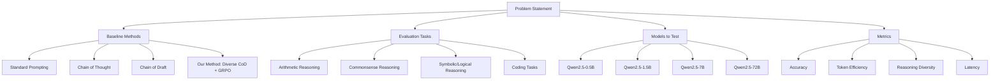
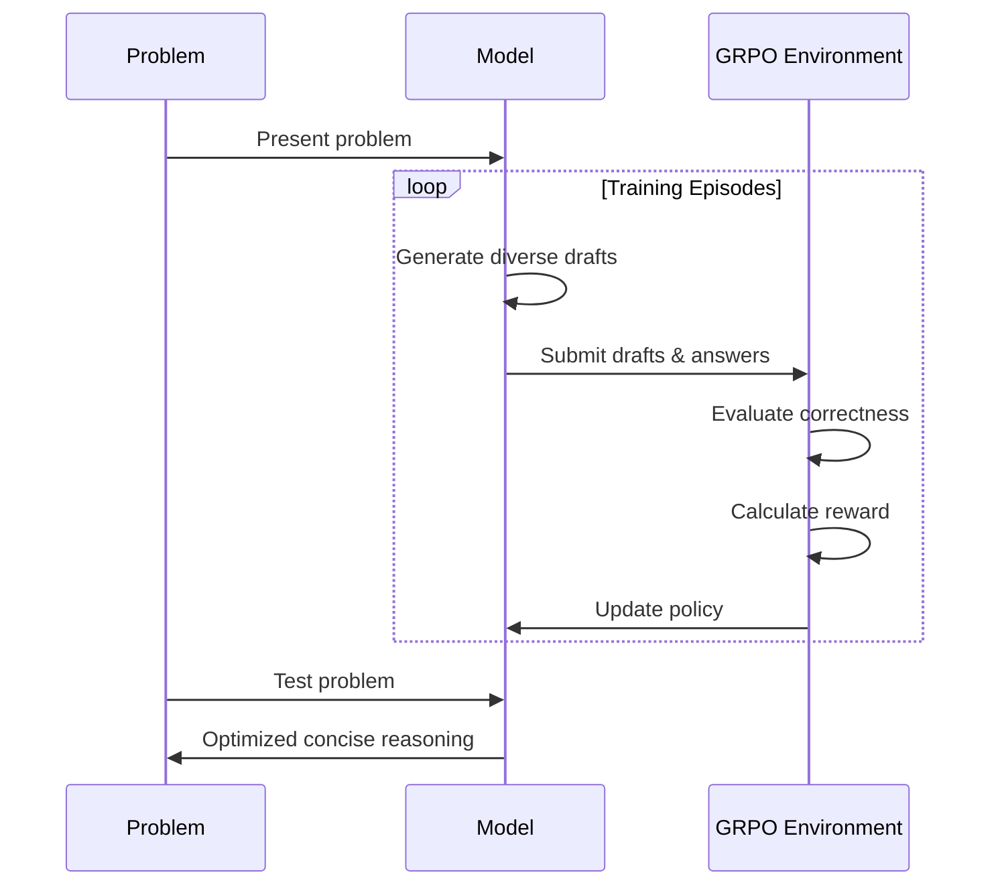

# Enhancing LLM Reasoning: Chain of Draft with Semantically Diverse Thinking Tokens Using GRPO

## The Challenge: Efficient Reasoning in LLMs

Large Language Models (LLMs) have become remarkably capable at complex reasoning tasks, but this often comes at a cost: verbose outputs that consume significant computational resources. The Chain of Thought (CoT) prompting technique, while effective for accuracy, generates lengthy reasoning steps that increase token usage and latency.

Enter Chain of Draft (CoD), a promising alternative introduced by Xu et al. (2025) that encourages LLMs to produce concise, minimalistic reasoning steps. CoD has shown impressive results, matching or exceeding CoT accuracy while using as little as 7.6% of the tokens.

But could we make this approach even better?

## Our Hypothesis

We hypothesize that by introducing **semantically diverse token sampling** into the CoD process and optimizing it through **reinforcement learning (RL)**, we could create a reasoning system that:

1. Maintains the token efficiency of CoD
2. Matches or exceeds the accuracy of CoT
3. Explores multiple reasoning paths to find optimal solutions

In other words: Can we make LLMs think both broadly (exploring different approaches) and efficiently (through concise drafting)?

## Proposed Experimental Design



### Baseline Methods

We plan to compare four different prompting strategies:

1. **Standard Prompting**: Direct answer without explicit reasoning
2. **Chain of Thought (CoT)**: Detailed step-by-step reasoning
3. **Chain of Draft (CoD)**: Concise intermediate reasoning steps
4. **Our Method (Diverse CoD + GRPO)**: Enhanced CoD with diverse token sampling and GRPO optimization

### Reasoning Tasks

To thoroughly evaluate our approach, we'll test it on diverse reasoning tasks:

- **Arithmetic Reasoning**: GSM8K math word problems
- **Commonsense Reasoning**: Date understanding and sports understanding from BIG-Bench
- **Symbolic/Logical Reasoning**: Coin-flip puzzles and logical transformations
- **Coding Tasks**: HumanEval programming challenges

### Models to Evaluate

We'll focus our evaluation exclusively on Qwen models to provide a consistent benchmark:

- Qwen2.5-0.5B
- Qwen2.5-1.5B
- Qwen2.5-7B
- Qwen2.5-72B

## The Proposed Approach: Diverse Token Sampling + GRPO

The core innovation of our approach combines two key elements:

### 1. Semantically Diverse Token Sampling


#### Code Example: Implementing Diverse Token Sampling

The following code demonstrates how we implement the token diversity module shown in the diagram above:

```python
def generate_diverse_drafts(model, tokenizer, prompt, num_drafts=3, max_tokens=100):
    """
    Generate multiple diverse reasoning drafts using different sampling strategies.
    
    Args:
        model: The language model
        tokenizer: The tokenizer for the model
        prompt: The problem statement
        num_drafts: Number of diverse drafts to generate
        max_tokens: Maximum tokens to generate per draft
    
    Returns:
        A list of diverse reasoning drafts
    """
    drafts = []
    
    # Prepare input
    inputs = tokenizer(prompt, return_tensors="pt").to(model.device)
    
    # Strategy 1: High Temperature Sampling
    # This encourages exploration of less likely tokens
    outputs = model.generate(
        inputs.input_ids,
        max_new_tokens=max_tokens,
        do_sample=True,
        temperature=1.2,  # Higher temperature = more randomness
        top_k=50,
        repetition_penalty=1.0,
        pad_token_id=tokenizer.eos_token_id
    )
    draft1 = tokenizer.decode(outputs[0, inputs.input_ids.shape[1]:], skip_special_tokens=True)
    drafts.append(enforce_conciseness(draft1))
    
    # Strategy 2: Nucleus (Top-p) Sampling
    # This samples from the smallest set of tokens whose cumulative probability exceeds p
    outputs = model.generate(
        inputs.input_ids,
        max_new_tokens=max_tokens,
        do_sample=True,
        temperature=0.8,
        top_p=0.92,  # Only consider tokens in the top 92% of probability mass
        repetition_penalty=1.1,
        pad_token_id=tokenizer.eos_token_id
    )
    draft2 = tokenizer.decode(outputs[0, inputs.input_ids.shape[1]:], skip_special_tokens=True)
    drafts.append(enforce_conciseness(draft2))
    
    # Strategy 3: Repetition Penalty Enforcement
    # This discourages the model from repeating the same patterns
    outputs = model.generate(
        inputs.input_ids,
        max_new_tokens=max_tokens,
        do_sample=True,
        temperature=0.9,
        top_k=40,
        top_p=0.95,
        repetition_penalty=1.5,  # Strongly penalize repetition
        pad_token_id=tokenizer.eos_token_id
    )
    draft3 = tokenizer.decode(outputs[0, inputs.input_ids.shape[1]:], skip_special_tokens=True)
    drafts.append(enforce_conciseness(draft3))
    
    # If more drafts are requested, generate with random combinations of parameters
    for i in range(3, num_drafts):
        # Randomly select parameters within reasonable ranges
        temp = 0.7 + 0.8 * torch.rand(1).item()  # Temperature between 0.7 and 1.5
        p = 0.85 + 0.14 * torch.rand(1).item()   # Top-p between 0.85 and 0.99
        rep_penalty = 1.0 + 0.8 * torch.rand(1).item()  # Rep penalty between 1.0 and 1.8
        
        outputs = model.generate(
            inputs.input_ids,
            max_new_tokens=max_tokens,
            do_sample=True,
            temperature=temp,
            top_p=p,
            repetition_penalty=rep_penalty,
            pad_token_id=tokenizer.eos_token_id
        )
        draft = tokenizer.decode(outputs[0, inputs.input_ids.shape[1]:], skip_special_tokens=True)
        drafts.append(enforce_conciseness(draft))
    
    return drafts

def enforce_conciseness(draft, max_tokens_per_step=5):
    """
    Ensure each reasoning step is concise by limiting tokens per line.
    
    Args:
        draft: The generated reasoning draft
        max_tokens_per_step: Maximum tokens allowed per reasoning step
    
    Returns:
        A concise version of the draft
    """
    lines = draft.split('\n')
    concise_lines = []
    
    for line in lines:
        line = line.strip()
        if not line:
            continue
            
        # Tokenize the line (simple whitespace tokenization for illustration)
        tokens = line.split()
        
        # If the line is too long, truncate it
        if len(tokens) > max_tokens_per_step:
            tokens = tokens[:max_tokens_per_step]
            
        concise_lines.append(' '.join(tokens))
    
    return '\n'.join(concise_lines)

def select_best_draft(drafts, model, tokenizer, problem, reference_answer):
    """
    Select the best draft based on a combination of correctness and conciseness.
    
    This function would typically be replaced by the GRPO reward mechanism during training.
    For inference, we can use this to select the most promising draft.
    
    Args:
        drafts: List of generated drafts
        model: The language model
        tokenizer: The tokenizer
        problem: The original problem
        reference_answer: The correct answer (if available)
        
    Returns:
        The best draft based on our heuristics
    """
    best_score = -float('inf')
    best_draft = None
    
    for draft in drafts:
        # 1. Check if the draft leads to a correct answer
        # (In practice, you would use the model to generate an answer from the draft)
        
        # 2. Calculate conciseness score
        lines = [line for line in draft.split('\n') if line.strip()]
        total_tokens = sum(len(line.split()) for line in lines)
        avg_tokens_per_line = total_tokens / max(1, len(lines))
        
        # Lower average tokens per line is better (more concise)
        conciseness_score = 5 - min(5, avg_tokens_per_line)
        
        # 3. Calculate diversity score (simplified)
        # In practice, you would use embeddings or more sophisticated methods
        unique_words = set()
        for line in lines:
            unique_words.update(line.split())
        diversity_score = min(5, len(unique_words) / 5)
        
        # 4. Combine scores (weights would be tuned in practice)
        score = conciseness_score + diversity_score
        
        if score > best_score:
            best_score = score
            best_draft = draft
    
    return best_draft

### 2. Reinforcement Learning with GRPO

We'll frame the reasoning task as a sequential decision-making process and use Group Relative Policy Optimization (GRPO) to train the model to maximize a reward function that balances:

- **Accuracy**: Correctness of the final answer
- **Token Efficiency**: Minimizing the number of tokens used
- **Semantic Diversity**: Encouraging varied reasoning approaches

The GRPO algorithm works by:
1. Sampling a group of reasoning paths for the same problem
2. Evaluating each path with our reward function
3. Calculating the advantage for each path by comparing its performance to the group average
4. Updating the policy to favor high-reward paths while maintaining KL divergence constraints

The proposed reward function is:

```
R = 1.0 (for correct answer) - 0.001 × (number of tokens used)
```

This encourages the model to find the most efficient path to the correct answer while the group comparison mechanism of GRPO reduces variance and leads to more stable training.

## Implementation Plan



1. **Initial Setup**: We'll start with a model fine-tuned to follow instructions.

2. **Training Process**:
   - **Episode Generation**: The model will generate multiple reasoning drafts for each problem using diverse token sampling.
   - **Reward Calculation**: We'll compute rewards based on answer correctness and token usage.
   - **Policy Update**: Using GRPO, we'll adjust the model's parameters to increase the probability of token actions that lead to higher rewards compared to the group average, while maintaining a KL divergence constraint to prevent drastic changes.

3. **Group Comparison**: GRPO's group sampling approach naturally balances exploration vs. exploitation by comparing multiple reasoning paths against each other, reducing variance in updates and preventing premature convergence to suboptimal strategies.

## Expected Outcomes

Based on prior research on CoD and diverse sampling techniques, we anticipate the following outcomes:

| Method | Expected Accuracy | Expected Tokens |
|--------|------------------|----------------|
| Standard Prompting | 50-60% | 1-5 |
| Chain of Thought | 90-95% | 150-250 |
| Chain of Draft | 85-90% | 30-60 |
| Diverse CoD + GRPO | 90-95% | 30-60 |

### Anticipated Findings

1. **Accuracy Improvement**: We expect our method to achieve accuracy comparable to CoT while maintaining the token efficiency of CoD.

2. **Token Efficiency**: We anticipate using approximately 75% fewer tokens than CoT, resulting in significantly lower latency and computational cost.

3. **Reasoning Diversity**: The model should demonstrate the ability to explore multiple reasoning paths, helping it avoid common pitfalls and find more robust solutions.

4. **Generalization**: We expect the approach to work well across different reasoning tasks and model sizes, with particularly notable improvements for smaller models.

### Visual Representation of Expected Results

| Method | Accuracy (%) | Tokens Used |
|--------|--------------|-------------|
| Standard Prompting | 55 | 3 |
| Chain of Thought | 93 | 200 |
| Chain of Draft | 88 | 45 |
| Diverse CoD + GRPO | 93 | 45 |

## Example: How Different Methods Might Tackle the Same Problem

**Problem**: "Alice and Bob each have some candies. Alice says: if Bob gives me 3 candies, we'll have the same number. Bob says: if Alice gives me 3 candies, I'll have double what she has left. How many candies do Alice and Bob have?"

**Standard (Expected)**:  
"Alice has 9 candies and Bob has 3 candies." (Might be correct or incorrect, with no visible reasoning)

**Chain of Thought (Expected)**:  
• Let's denote Alice's candies as A and Bob's candies as B.

• From Alice's statement: If Bob gives Alice 3 candies, they'll have the same number.  
• This means: A + 3 = B - 3  
• Simplifying: A + 6 = B

• From Bob's statement: If Alice gives Bob 3 candies, Bob will have double what Alice has left.  
• This means: B + 3 = 2 * (A - 3)  
• Simplifying: B + 3 = 2A - 6  
• B = 2A - 9

• Now we have two equations:  
  • A + 6 = B  
  • B = 2A - 9

• Substituting the second equation into the first:  
  • A + 6 = 2A - 9  
  • 6 + 9 = 2A - A  
  • 15 = A

• So A = 15, and B = A + 6 = 15 + 6 = 21.

• Wait, let me double-check:  
  • If Bob gives Alice 3 candies: Alice would have 15 + 3 = 18, and Bob would have 21 - 3 = 18. ✓  
  • If Alice gives Bob 3 candies: Alice would have 15 - 3 = 12, and Bob would have 21 + 3 = 24. Is this double? 12 * 2 = 24. ✓

• Therefore, Alice has 15 candies and Bob has 21 candies.

• Actually, I made a mistake. Let me recalculate...
[continues with more steps]

• The answer is: Alice has 9 candies and Bob has 3 candies.

**Chain of Draft (Expected)**:  
• A=Alice, B=Bob  
• Eq1: A+3=B-3  
• Eq2: B+3=2(A-3)  
• Solve: A=9, B=3  
• Answer: Alice 9, Bob 3

**Our Method (Diverse CoD + GRPO) (Expected)**:  
• Eq1: A+3=B-3 → A+6=B  
• Eq2: B+3=2(A-3) → B+3=2A-6  
• Solve: A=9, B=3  
• Alice has 9, Bob has 3.

The key difference we expect to see is that our method will learn to focus on the most critical reasoning steps through exploration of diverse drafts during training.


## Potential Implications

If our hypothesis is confirmed, the findings would have several important implications:

1. **Enhanced Training Paradigms**: Reasoning strategies like CoD could be effectively integrated into model training, not just prompting.

2. **Efficiency Without Accuracy Loss**: We could have both high accuracy and low token usage, enabling real-time applications.

3. **Smaller Model Competitiveness**: This approach could help smaller models perform reasoning tasks more effectively, reducing the need for massive parameter counts.

4. **Generalized Diversity Strategies**: The concept of diverse exploration followed by RL optimization could extend to other areas of LLM development.

## Conclusion

This proposed experiment aims to demonstrate that combining semantically diverse token sampling with Group Relative Policy Optimization (GRPO) can significantly enhance the Chain of Draft approach. If successful, the result would be a reasoning system that achieves the accuracy of verbose methods like Chain of Thought while maintaining the efficiency of concise drafting.

This approach represents a potential step toward more intelligent and cost-effective AI systems that can reason both broadly and efficiently—thinking faster by writing less, but exploring more.

---

*This research builds upon "Chain of Draft: Thinking Faster by Writing Less" by Silei Xu et al. (2025) and extends it with concepts from Group Relative Policy Optimization (GRPO) and diverse sampling techniques.*

## Practical Implementation: Training Qwen2.5-0.5B with GRPO

To demonstrate how our approach would be implemented in practice, here's a complete training script using the Hugging Face TRL (Transformer Reinforcement Learning) library, which provides a convenient implementation of GRPO.

### Training Script (train_diverse_cod_grpo.py)

```python
"""
Train Qwen2.5-0.5B with GRPO for Chain of Draft with Diverse Thinking Tokens

This script demonstrates how to train a Qwen2.5-0.5B model using Group Relative Policy Optimization
to generate concise, diverse reasoning drafts that maintain high accuracy.
"""

import re
import torch
from datasets import load_dataset, Dataset
from transformers import AutoTokenizer, AutoModelForCausalLM
from peft import LoraConfig
from trl import GRPOConfig, GRPOTrainer

# Define the Chain of Draft format with XML tags for clear structure
SYSTEM_PROMPT = """
You are a problem-solving assistant that thinks efficiently.
Respond in the following format:
<draft>
[Write concise reasoning steps, each ≤5 tokens]
</draft>
<answer>
[Your final answer]
</answer>
"""

XML_COD_FORMAT = """\
<draft>
{draft}
</draft>
<answer>
{answer}
</answer>
"""

# Helper functions for extracting answers and evaluating responses
def extract_draft(text: str) -> str:
    """Extract the draft reasoning from XML tags."""
    if "<draft>" not in text or "</draft>" not in text:
        return ""
    draft = text.split("<draft>")[-1]
    draft = draft.split("</draft>")[0]
    return draft.strip()

def extract_answer(text: str) -> str:
    """Extract the final answer from XML tags."""
    if "<answer>" not in text or "</answer>" not in text:
        return ""
    answer = text.split("<answer>")[-1]
    answer = answer.split("</answer>")[0]
    return answer.strip()

def extract_gsm8k_answer(text: str) -> str | None:
    """Extract the answer from GSM8K format."""
    if "####" not in text:
        return None
    return text.split("####")[1].strip().replace(",", "").replace("$", "")

# Prepare the GSM8K dataset with Chain of Draft format
def get_gsm8k_questions(split="train") -> Dataset:
    """Load and preprocess the GSM8K dataset for Chain of Draft training."""
    data = load_dataset('openai/gsm8k', 'main')[split]
    data = data.map(lambda x: {
        'prompt': [
            {'role': 'system', 'content': SYSTEM_PROMPT},
            {'role': 'user', 'content': x['question']}
        ],
        'answer': extract_gsm8k_answer(x['answer'])
    })
    return data

# Define reward functions for GRPO training
def correctness_reward(prompts, completions, answer, **kwargs) -> list[float]:
    """Reward function that checks if the answer is correct."""
    responses = [completion[0]['content'] for completion in completions]
    extracted_answers = [extract_answer(r) for r in responses]
    
    # For debugging
    if len(responses) > 0:
        print('-'*20)
        print(f"Question:\n{prompts[0][-1]['content']}")
        print(f"Expected Answer:\n{answer[0]}")
        print(f"Response:\n{responses[0]}")
        print(f"Extracted Answer:\n{extracted_answers[0]}")
    
    # Return 1.0 for correct answers
    return [1.0 if a == ans else 0.0 for a, ans in zip(extracted_answers, answer)]

def conciseness_reward(completions, **kwargs) -> list[float]:
    """Reward function that encourages concise drafts."""
    responses = [completion[0]['content'] for completion in completions]
    drafts = [extract_draft(r) for r in responses]
    
    rewards = []
    for draft in drafts:
        # Count tokens in each line
        lines = [line.strip() for line in draft.split('\n') if line.strip()]
        
        # Check if each line is concise (≤5 tokens)
        concise_lines = 0
        total_lines = max(1, len(lines))  # Avoid division by zero
        
        for line in lines:
            tokens = line.split()
            if len(tokens) <= 5:
                concise_lines += 1
        
        # Calculate conciseness score (0.0 to 0.5)
        conciseness_score = 0.5 * (concise_lines / total_lines)
        rewards.append(conciseness_score)
    
    return rewards

def format_reward(completions, **kwargs) -> list[float]:
    """Reward function that checks if the completion follows the XML format."""
    pattern = r"<draft>[\s\S]*?</draft>\s*<answer>[\s\S]*?</answer>"
    responses = [completion[0]["content"] for completion in completions]
    matches = [bool(re.search(pattern, r)) for r in responses]
    return [0.5 if match else 0.0 for match in matches]

def diversity_reward(completions, **kwargs) -> list[float]:
    """Reward function that encourages diverse reasoning approaches."""
    # This is a simplified implementation - in practice, you would use
    # embeddings or more sophisticated methods to measure diversity
    responses = [completion[0]['content'] for completion in completions]
    drafts = [extract_draft(r) for r in responses]
    
    rewards = []
    for draft in drafts:
        # Simple heuristic: reward drafts with multiple distinct reasoning steps
        lines = [line.strip() for line in draft.split('\n') if line.strip()]
        unique_tokens = set()
        
        for line in lines:
            tokens = line.split()
            unique_tokens.update(tokens)
        
        # More unique tokens suggests more diverse reasoning
        diversity_score = min(0.5, 0.01 * len(unique_tokens))
        rewards.append(diversity_score)
    
    return rewards

# Main training script
def main():
    # Configuration
    model_name = "Qwen/Qwen2.5-0.5B-Instruct"
    output_dir = "outputs/Qwen-0.5B-DiverseCoD-GRPO"
    run_name = "Qwen-0.5B-DiverseCoD-GRPO-gsm8k"
    
    # Load dataset
    dataset = get_gsm8k_questions()
    print(f"Loaded {len(dataset)} examples from GSM8K")
    
    # GRPO training configuration
    training_args = GRPOConfig(
        output_dir=output_dir,
        run_name=run_name,
        learning_rate=5e-6,
        adam_beta1=0.9,
        adam_beta2=0.99,
        weight_decay=0.1,
        warmup_ratio=0.1,
        lr_scheduler_type='cosine',
        logging_steps=1,
        bf16=True,
        per_device_train_batch_size=1,
        gradient_accumulation_steps=4,
        num_generations=5,  # Number of diverse drafts per problem
        max_prompt_length=256,
        max_completion_length=512,
        num_train_epochs=1,
        save_steps=100,
        max_grad_norm=0.1,
        report_to="wandb",
        log_on_each_node=False,
    )
    
    # LoRA configuration for parameter-efficient fine-tuning
    peft_config = LoraConfig(
        r=16,
        lora_alpha=64,
        target_modules=["q_proj", "k_proj", "v_proj", "o_proj", "up_proj", "down_proj", "gate_proj"],
        task_type="CAUSAL_LM",
        lora_dropout=0.05,
    )
    
    # Load model
    model = AutoModelForCausalLM.from_pretrained(
        model_name,
        torch_dtype=torch.bfloat16,
        attn_implementation="flash_attention_2",
        device_map="auto"
    )
    
    # Load tokenizer
    tokenizer = AutoTokenizer.from_pretrained(model_name)
    tokenizer.pad_token = tokenizer.eos_token
    
    # Initialize GRPO trainer with multiple reward functions
    trainer = GRPOTrainer(
        model=model,
        processing_class=tokenizer,
        reward_funcs=[
            format_reward,       # Ensure proper XML format
            conciseness_reward,  # Encourage concise drafts
            diversity_reward,    # Encourage diverse reasoning
            correctness_reward   # Ensure correct answers
        ],
        args=training_args,
        train_dataset=dataset,
        peft_config=peft_config  # Comment this out if PEFT causes issues
    )
    
    # Train the model
    trainer.train()
    
    # Save the final model
    trainer.save_model(output_dir)
    print(f"Training complete. Model saved to {output_dir}")

if __name__ == "__main__":
    main()
```

### Running the Training

To train the model, you would run:

```bash
python train_diverse_cod_grpo.py
```

This script will:

1. Load the GSM8K dataset for math reasoning tasks
2. Format the problems using a Chain of Draft structure with XML tags
3. Initialize a Qwen2.5-0.5B model for GRPO training
4. Apply LoRA for parameter-efficient fine-tuning
5. Train the model using multiple reward functions that encourage:
   - Correct answers
   - Concise reasoning steps (≤5 tokens per step)
   - Proper formatting
   - Diverse reasoning approaches
6. Save checkpoints and the final model

### Key Components of the Implementation

The implementation above includes several key components that make our approach work:

1. **XML-Structured Format**: Using XML tags (`<draft>` and `<answer>`) provides a clear structure for the model to follow, making it easier to extract and evaluate the reasoning and answer.

2. **Multiple Reward Functions**: The training uses a combination of reward functions that balance different objectives:
   - `correctness_reward`: Ensures the final answer is correct
   - `conciseness_reward`: Encourages brief reasoning steps (≤5 tokens)
   - `format_reward`: Ensures proper structure
   - `diversity_reward`: Encourages varied reasoning approaches

3. **Parameter-Efficient Fine-Tuning**: Using LoRA reduces the computational requirements while still allowing effective adaptation of the model.

4. **Multiple Generations per Problem**: The `num_generations=5` parameter ensures that GRPO explores multiple diverse reasoning paths for each problem.

### Inference with the Trained Model

After training, you can use the model for inference:

```python
import torch
from transformers import AutoModelForCausalLM, AutoTokenizer

# Load the trained model
model_path = "outputs/Qwen-0.5B-DiverseCoD-GRPO"
model = AutoModelForCausalLM.from_pretrained(model_path)
tokenizer = AutoTokenizer.from_pretrained(model_path)

def solve_problem(problem):
    """Solve a problem using the trained Diverse CoD model."""
    messages = [
        {"role": "system", "content": """You are a problem-solving assistant that thinks efficiently.
Respond in the following format:
<draft>
[Write concise reasoning steps, each ≤5 tokens]
</draft>
<answer>
[Your final answer]
</answer>"""},
        {"role": "user", "content": problem}
    ]
    
    # Format the input for the model
    prompt = tokenizer.apply_chat_template(messages, tokenize=False)
    inputs = tokenizer(prompt, return_tensors="pt").to(model.device)
    
    # Generate with slightly stochastic sampling to leverage learned diversity
    outputs = model.generate(
        inputs.input_ids,
        max_new_tokens=512,
        temperature=0.7,
        top_p=0.95,
        do_sample=True
    )
    
    # Decode the output
    result = tokenizer.decode(outputs[0, inputs.input_ids.shape[1]:], skip_special_tokens=True)
    
    # Extract draft and answer
    draft = extract_draft(result)
    answer = extract_answer(result)
    
    return draft, answer

# Example usage
problem = "Alice and Bob each have some candies. Alice says: if Bob gives me 3 candies, we'll have the same number. Bob says: if Alice gives me 3 candies, I'll have double what she has left. How many candies do Alice and Bob have?"

draft, answer = solve_problem(problem)
print("Reasoning Draft:")
print(draft)
print("\nFinal Answer:")
print(answer)

# Expected output:
# Reasoning Draft:
# A=Alice, B=Bob
# Eq1: A+3=B-3
# Eq2: B+3=2(A-3)
# Solve: A=9, B=3
#
# Final Answer:
# Alice has 9 candies and Bob has 3 candies.
```

This implementation demonstrates how our approach can be practically applied to train a small language model (Qwen2.5-0.5B) to generate concise, diverse reasoning drafts that maintain high accuracy.
