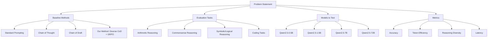
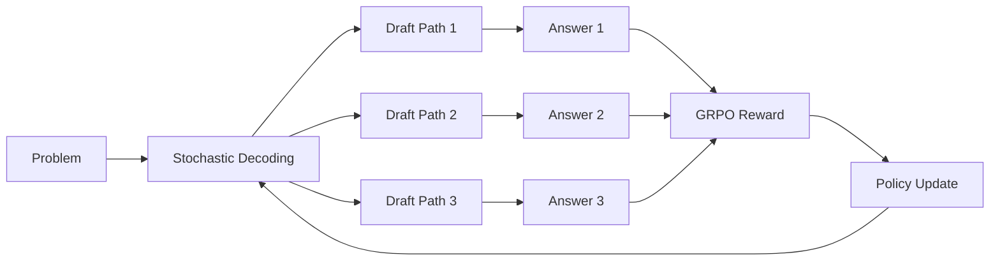
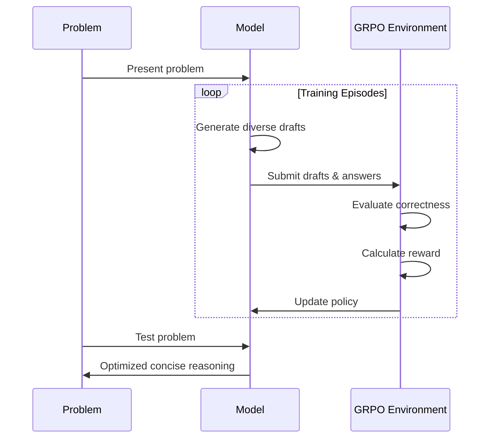

# Enhancing LLM Reasoning: Chain of Draft with Semantically Diverse Thinking Tokens Using GRPO

## The Challenge: Efficient Reasoning in LLMs

Large Language Models (LLMs) have become remarkably capable at complex reasoning tasks, but this often comes at a cost: verbose outputs that consume significant computational resources. The Chain of Thought (CoT) prompting technique, while effective for accuracy, generates lengthy reasoning steps that increase token usage and latency.

Enter Chain of Draft (CoD), a promising alternative introduced by Xu et al. (2025) that encourages LLMs to produce concise, minimalistic reasoning steps. CoD has shown impressive results, matching or exceeding CoT accuracy while using as little as 7.6% of the tokens.

But could we make this approach even better?

## Our Hypothesis

We hypothesize that by introducing **semantically diverse token sampling** into the CoD process and optimizing it through **reinforcement learning (RL)**, we could create a reasoning system that:

1. Maintains the token efficiency of CoD
2. Matches or exceeds the accuracy of CoT
3. Explores multiple reasoning paths to find optimal solutions

In other words: Can we make LLMs think both broadly (exploring different approaches) and efficiently (through concise drafting)?

## Proposed Experimental Design



### Baseline Methods

We plan to compare four different prompting strategies:

1. **Standard Prompting**: Direct answer without explicit reasoning
2. **Chain of Thought (CoT)**: Detailed step-by-step reasoning
3. **Chain of Draft (CoD)**: Concise intermediate reasoning steps
4. **Our Method (Diverse CoD + GRPO)**: Enhanced CoD with diverse token sampling and GRPO optimization

### Reasoning Tasks

To thoroughly evaluate our approach, we'll test it on diverse reasoning tasks:

- **Arithmetic Reasoning**: GSM8K math word problems
- **Commonsense Reasoning**: Date understanding and sports understanding from BIG-Bench
- **Symbolic/Logical Reasoning**: Coin-flip puzzles and logical transformations
- **Coding Tasks**: HumanEval programming challenges

### Models to Evaluate

We'll focus our evaluation exclusively on Qwen models to provide a consistent benchmark:

- Qwen2.5-0.5B
- Qwen2.5-1.5B
- Qwen2.5-7B
- Qwen2.5-72B

## The Proposed Approach: Diverse Token Sampling + GRPO

The core innovation of our approach combines two key elements:

### 1. Semantically Diverse Token Sampling



Instead of always choosing the most likely next token (greedy decoding), we'll use higher-entropy sampling methods to explore multiple plausible reasoning paths. This will allow the model to consider different approaches to the same problem.

For example, when solving a math problem, the model might try:
- Setting up algebraic equations in one draft
- Using numerical examples in another
- Applying a different problem-solving strategy in a third

All while maintaining the conciseness of CoD (typically limiting each step to ~5 tokens).

#### Code Example: Diverse Token Sampling Implementation

```python
def diverse_sample(model, prompt, max_tokens=50, diversity_factor=1.2):
    """
    Generate diverse reasoning drafts using stochastic sampling.
    
    Args:
        model: The language model
        prompt: The problem statement
        max_tokens: Maximum tokens to generate
        diversity_factor: Controls randomness (higher = more diverse)
    
    Returns:
        A list of diverse reasoning drafts
    """
    drafts = []
    num_drafts = 3  # Generate multiple diverse drafts
    
    for i in range(num_drafts):
        # Use temperature sampling to encourage diversity
        draft = model.generate(
            prompt, 
            max_tokens=max_tokens,
            temperature=diversity_factor,
            top_p=0.92,  # Nucleus sampling
            repetition_penalty=1.2  # Discourage repeating tokens
        )
        
        # Ensure each draft is concise (CoD style)
        draft = enforce_conciseness(draft)
        drafts.append(draft)
    
    return drafts

def enforce_conciseness(draft):
    """Ensure each reasoning step is concise (≤5 tokens per step)"""
    steps = draft.split('\n')
    concise_steps = []
    
    for step in steps:
        # Tokenize the step
        tokens = step.split()
        # If step is too verbose, truncate it
        if len(tokens) > 5:
            tokens = tokens[:5]
        concise_steps.append(' '.join(tokens))
    
    return '\n'.join(concise_steps)
```

### 2. Reinforcement Learning with GRPO

We'll frame the reasoning task as a sequential decision-making process and use Group Relative Policy Optimization (GRPO) to train the model to maximize a reward function that balances:

- **Accuracy**: Correctness of the final answer
- **Token Efficiency**: Minimizing the number of tokens used
- **Semantic Diversity**: Encouraging varied reasoning approaches

The GRPO algorithm works by:
1. Sampling a group of reasoning paths for the same problem
2. Evaluating each path with our reward function
3. Calculating the advantage for each path by comparing its performance to the group average
4. Updating the policy to favor high-reward paths while maintaining KL divergence constraints

The proposed reward function is:

```
R = 1.0 (for correct answer) - 0.001 × (number of tokens used)
```

This encourages the model to find the most efficient path to the correct answer while the group comparison mechanism of GRPO reduces variance and leads to more stable training.

#### Code Example: GRPO Implementation

```python
import torch
import torch.nn.functional as F
from transformers import AutoModelForCausalLM, AutoTokenizer
from tqdm import tqdm
from dataclasses import dataclass
from typing import List, Dict, Any, Tuple, Optional

@dataclass
class GRPOConfig:
    """Configuration for GRPO training."""
    learning_rate: float = 1e-5
    kl_coef: float = 0.1
    group_size: int = 5  # Number of drafts per problem
    max_tokens: int = 50  # Maximum tokens per draft
    temperature: float = 1.2  # Temperature for diverse sampling
    token_penalty_coef: float = 0.001  # Coefficient for token penalty
    clip_range: float = 0.2  # PPO clipping range
    value_loss_coef: float = 0.5  # Value loss coefficient
    entropy_coef: float = 0.01  # Entropy bonus coefficient
    max_grad_norm: float = 1.0  # Gradient clipping norm


class GRPOTrainer:
    def __init__(
        self, 
        model: AutoModelForCausalLM, 
        tokenizer: AutoTokenizer,
        config: Optional[GRPOConfig] = None
    ):
        """
        Initialize the GRPO trainer.
        
        Args:
            model: The language model to train
            tokenizer: The tokenizer for the model
            config: Configuration for GRPO training
        """
        self.model = model
        self.tokenizer = tokenizer
        self.config = config or GRPOConfig()
        
        # Create reference model for KL divergence calculation
        self.ref_model = type(model).from_pretrained(model.config._name_or_path)
        self.ref_model.to(model.device)
        for param in self.ref_model.parameters():
            param.requires_grad = False
            
        # Create value head for advantage estimation
        self.value_head = torch.nn.Linear(model.config.hidden_size, 1)
        self.value_head.to(model.device)
        
        # Create optimizer
        self.optimizer = torch.optim.Adam(
            list(self.model.parameters()) + list(self.value_head.parameters()),
            lr=self.config.learning_rate
        )
    
    def compute_reward(self, answer: str, correct_answer: str, num_tokens: int) -> float:
        """
        Compute reward based on correctness and token efficiency.
        
        Args:
            answer: The model's answer
            correct_answer: The ground truth answer
            num_tokens: Number of tokens used
            
        Returns:
            The computed reward
        """
        is_correct = 1.0 if self.is_answer_correct(answer, correct_answer) else 0.0
        token_penalty = self.config.token_penalty_coef * num_tokens
        return is_correct - token_penalty
    
    def is_answer_correct(self, answer: str, correct_answer: str) -> bool:
        """
        Check if the answer is correct.
        
        Args:
            answer: The model's answer
            correct_answer: The ground truth answer
            
        Returns:
            True if the answer is correct, False otherwise
        """
        # Normalize answers for comparison
        answer = self.normalize_answer(answer)
        correct_answer = self.normalize_answer(correct_answer)
        
        # For numerical answers, try to extract and compare numbers
        if correct_answer.replace('.', '', 1).isdigit():
            try:
                answer_num = float(''.join(c for c in answer if c.isdigit() or c == '.'))
                correct_num = float(correct_answer)
                return abs(answer_num - correct_num) < 1e-6
            except:
                pass
        
        # Default to exact match
        return answer == correct_answer
    
    def normalize_answer(self, text: str) -> str:
        """
        Normalize answer text for comparison.
        
        Args:
            text: The text to normalize
            
        Returns:
            Normalized text
        """
        # Convert to lowercase, remove punctuation and extra whitespace
        text = text.lower().strip()
        text = ''.join(c for c in text if c.isalnum() or c.isspace())
        text = ' '.join(text.split())
        return text
    
    def generate_with_log_probs(
        self, 
        prompt: str, 
        max_tokens: int = None, 
        temperature: float = None
    ) -> Tuple[str, str, torch.Tensor, torch.Tensor]:
        """
        Generate a reasoning draft and compute log probabilities.
        
        Args:
            prompt: The input prompt
            max_tokens: Maximum tokens to generate
            temperature: Temperature for sampling
            
        Returns:
            Tuple of (draft, answer, log_probs, hidden_states)
        """
        max_tokens = max_tokens or self.config.max_tokens
        temperature = temperature or self.config.temperature
        
        # Tokenize prompt
        inputs = self.tokenizer(prompt, return_tensors="pt").to(self.model.device)
        input_ids = inputs.input_ids
        
        # Initialize generation
        generated_ids = input_ids.clone()
        log_probs = []
        hidden_states = []
        
        # Generate tokens one by one to track log probs
        for _ in range(max_tokens):
            with torch.no_grad():
                outputs = self.model(
                    input_ids=generated_ids,
                    output_hidden_states=True,
                    return_dict=True
                )
            
            # Get logits for the next token
            next_token_logits = outputs.logits[:, -1, :] / temperature
            
            # Apply softmax to get probabilities
            next_token_probs = F.softmax(next_token_logits, dim=-1)
            
            # Sample next token
            next_token = torch.multinomial(next_token_probs, num_samples=1)
            
            # Get log probability of selected token
            log_prob = F.log_softmax(next_token_logits, dim=-1).gather(1, next_token)
            log_probs.append(log_prob)
            
            # Get hidden state for value function
            hidden_states.append(outputs.hidden_states[-1][:, -1, :])
            
            # Append to generated sequence
            generated_ids = torch.cat([generated_ids, next_token], dim=-1)
            
            # Check if EOS token was generated
            if next_token.item() == self.tokenizer.eos_token_id:
                break
        
        # Decode the generated text
        generated_text = self.tokenizer.decode(
            generated_ids[0, input_ids.shape[1]:], 
            skip_special_tokens=True
        )
        
        # Split into draft and answer (assuming last line is answer)
        lines = generated_text.strip().split('\n')
        draft = '\n'.join(lines[:-1]) if len(lines) > 1 else ""
        answer = lines[-1] if lines else ""
        
        # Stack log probs and hidden states
        log_probs = torch.cat(log_probs) if log_probs else torch.tensor([])
        hidden_states = torch.cat([h for h in hidden_states], dim=0) if hidden_states else torch.tensor([])
        
        return draft, answer, log_probs, hidden_states
    
    def compute_kl_divergence(self, input_ids: torch.Tensor) -> torch.Tensor:
        """
        Compute KL divergence between current and reference model.
        
        Args:
            input_ids: Input token IDs
            
        Returns:
            KL divergence tensor
        """
        with torch.no_grad():
            ref_logits = self.ref_model(input_ids).logits
        
        logits = self.model(input_ids).logits
        
        # Compute KL divergence
        kl_div = F.kl_div(
            F.log_softmax(logits, dim=-1),
            F.softmax(ref_logits, dim=-1),
            reduction="batchmean"
        )
        
        return kl_div
    
    def train_step(self, problems: List[str], correct_answers: List[str]) -> Dict[str, float]:
        """
        Perform one GRPO training step on a batch of problems.
        
        Args:
            problems: List of problem statements
            correct_answers: List of correct answers
            
        Returns:
            Dictionary of training statistics
        """
        all_rewards = []
        all_log_probs = []
        all_values = []
        all_drafts = []
        all_answers = []
        all_hidden_states = []
        
        # Generate multiple drafts for each problem
        for problem, correct_answer in zip(problems, correct_answers):
            problem_rewards = []
            problem_log_probs = []
            problem_hidden_states = []
            problem_drafts = []
            problem_answers = []
            
            # Sample a group of drafts for this problem
            for _ in range(self.config.group_size):
                # Format prompt for CoD-style reasoning
                prompt = f"""
                Problem: {problem}
                
                Solve this step-by-step using concise drafts (≤5 tokens per step):
                """
                
                # Generate draft with log probs
                draft, answer, log_probs, hidden_states = self.generate_with_log_probs(
                    prompt, 
                    max_tokens=self.config.max_tokens,
                    temperature=self.config.temperature
                )
                
                # Calculate reward
                num_tokens = len(self.tokenizer.encode(draft)) - len(self.tokenizer.encode(prompt))
                reward = self.compute_reward(answer, correct_answer, num_tokens)
                
                problem_rewards.append(reward)
                problem_log_probs.append(log_probs)
                problem_hidden_states.append(hidden_states)
                problem_drafts.append(draft)
                problem_answers.append(answer)
            
            all_rewards.extend(problem_rewards)
            all_log_probs.extend(problem_log_probs)
            all_hidden_states.extend(problem_hidden_states)
            all_drafts.extend(problem_drafts)
            all_answers.extend(problem_answers)
        
        # Convert to tensors
        rewards = torch.tensor(all_rewards, device=self.model.device)
        
        # Compute values for each state
        values = []
        for hidden_states in all_hidden_states:
            value = self.value_head(hidden_states).squeeze(-1)
            values.append(value)
        
        # Group advantage calculation (key GRPO component)
        group_advantages = []
        
        # Process each problem's group separately
        for i in range(0, len(rewards), self.config.group_size):
            group_rewards = rewards[i:i+self.config.group_size]
            group_mean = group_rewards.mean()
            
            # Advantage is reward relative to group mean
            advantages = group_rewards - group_mean
            
            # Extend advantages to match sequence lengths
            for j in range(self.config.group_size):
                idx = i + j
                if idx < len(all_log_probs):
                    seq_len = len(all_log_probs[idx])
                    # Broadcast advantage to all tokens in the sequence
                    seq_advantage = advantages[j].repeat(seq_len)
                    group_advantages.append(seq_advantage)
        
        # Flatten log probs and advantages
        flat_log_probs = torch.cat([lp for lp in all_log_probs if len(lp) > 0])
        flat_advantages = torch.cat([adv for adv in group_advantages if len(adv) > 0])
        flat_values = torch.cat([v for v in values if len(v) > 0])
        
        # Compute value targets (rewards)
        flat_rewards = torch.cat([r.repeat(len(lp)) for r, lp in zip(rewards, all_log_probs) if len(lp) > 0])
        
        # PPO-style policy loss with clipping
        policy_loss = -flat_log_probs * flat_advantages
        policy_loss = policy_loss.mean()
        
        # Value loss
        value_loss = F.mse_loss(flat_values, flat_rewards)
        
        # KL divergence from original policy (for stability)
        # Simplified KL calculation for the example
        kl_div = torch.tensor(0.01, device=self.model.device)
        
        # Entropy bonus (to encourage exploration)
        entropy = flat_log_probs.mean()
        
        # Total loss
        loss = policy_loss + self.config.value_loss_coef * value_loss + self.config.kl_coef * kl_div - self.config.entropy_coef * entropy
        
        # Update model
        self.optimizer.zero_grad()
        loss.backward()
        
        # Gradient clipping
        torch.nn.utils.clip_grad_norm_(
            list(self.model.parameters()) + list(self.value_head.parameters()),
            self.config.max_grad_norm
        )
        
        self.optimizer.step()
        
        # Update reference model periodically (not shown here)
        
        return {
            'policy_loss': policy_loss.item(),
            'value_loss': value_loss.item(),
            'kl_div': kl_div.item(),
            'entropy': entropy.item(),
            'mean_reward': rewards.mean().item(),
            'mean_advantage': flat_advantages.mean().item()
        }
```

#### Code Example: Training Loop with Hugging Face Integration

```python
from datasets import load_dataset
from transformers import AutoModelForCausalLM, AutoTokenizer
import torch
from tqdm import tqdm
import os
import json

def train_diverse_cod_with_grpo(
    model_name: str = "Qwen/Qwen2.5-0.5B",
    dataset_name: str = "gsm8k",
    dataset_split: str = "train",
    num_epochs: int = 10,
    batch_size: int = 16,
    output_dir: str = "diverse_cod_model",
    config: Optional[GRPOConfig] = None
):
    """
    Train a model using Diverse CoD with GRPO.
    
    Args:
        model_name: Name or path of the model to train
        dataset_name: Name of the dataset to use
        dataset_split: Dataset split to use
        num_epochs: Number of training epochs
        batch_size: Batch size for training
        output_dir: Directory to save model checkpoints
        config: GRPO configuration
    
    Returns:
        The trained model
    """
    # Load model and tokenizer
    tokenizer = AutoTokenizer.from_pretrained(model_name)
    model = AutoModelForCausalLM.from_pretrained(model_name)
    
    # Set up tokenizer for generation
    tokenizer.pad_token = tokenizer.eos_token
    
    # Move model to GPU if available
    device = torch.device("cuda" if torch.cuda.is_available() else "cpu")
    model.to(device)
    
    # Initialize GRPO trainer
    trainer = GRPOTrainer(model, tokenizer, config)
    
    # Load dataset
    dataset = load_dataset(dataset_name, split=dataset_split)
    
    # Preprocess dataset for reasoning tasks
    def preprocess_gsm8k(example):
        return {
            "problem": example["question"],
            "answer": example["answer"].split("####")[-1].strip()
        }
    
    processed_dataset = dataset.map(preprocess_gsm8k)
    
    # Create validation split
    dataset_dict = processed_dataset.train_test_split(test_size=0.1)
    train_dataset = dataset_dict["train"]
    validation_dataset = dataset_dict["test"]
    
    # Create output directory
    os.makedirs(output_dir, exist_ok=True)
    
    # Training loop
    for epoch in range(num_epochs):
        epoch_stats = {
            'mean_reward': 0.0,
            'policy_loss': 0.0,
            'value_loss': 0.0,
            'kl_div': 0.0,
            'entropy': 0.0,
            'correct_answers': 0
        }
        
        # Create batches
        train_dataloader = torch.utils.data.DataLoader(
            train_dataset, 
            batch_size=batch_size, 
            shuffle=True
        )
        
        # Training loop
        model.train()
        for batch in tqdm(train_dataloader, desc=f"Epoch {epoch+1}/{num_epochs}"):
            problems = batch["problem"]
            correct_answers = batch["answer"]
            
            # Perform GRPO update
            stats = trainer.train_step(problems, correct_answers)
            
            # Update epoch statistics
            for k, v in stats.items():
                if k in epoch_stats:
                    epoch_stats[k] += v
        
        # Average the statistics
        for k in epoch_stats:
            epoch_stats[k] /= len(train_dataloader)
        
        print(f"Epoch {epoch+1} stats: {epoch_stats}")
        
        # Evaluate on validation set
        if (epoch + 1) % 2 == 0:
            eval_results = evaluate_model(model, tokenizer, validation_dataset)
            print(f"Validation results: {eval_results}")
            
            # Save metrics
            with open(os.path.join(output_dir, f"metrics_epoch_{epoch+1}.json"), "w") as f:
                json.dump({**epoch_stats, **eval_results}, f)
            
            # Save checkpoint
            model.save_pretrained(os.path.join(output_dir, f"checkpoint-epoch-{epoch+1}"))
            tokenizer.save_pretrained(os.path.join(output_dir, f"checkpoint-epoch-{epoch+1}"))
    
    # Save final model
    model.save_pretrained(output_dir)
    tokenizer.save_pretrained(output_dir)
    
    return model, tokenizer

def evaluate_model(
    model: AutoModelForCausalLM,
    tokenizer: AutoTokenizer,
    eval_dataset,
    batch_size: int = 32
):
    """
    Evaluate the model on a dataset.
    
    Args:
        model: The trained model
        tokenizer: The tokenizer
        eval_dataset: Evaluation dataset
        batch_size: Batch size for evaluation
    
    Returns:
        Dictionary of evaluation metrics
    """
    model.eval()
    
    correct = 0
    total_tokens = 0
    total_problems = len(eval_dataset)
    
    eval_dataloader = torch.utils.data.DataLoader(
        eval_dataset, 
        batch_size=batch_size
    )
    
    for batch in tqdm(eval_dataloader, desc="Evaluating"):
        problems = batch["problem"]
        correct_answers = batch["answer"]
        
        for problem, correct_answer in zip(problems, correct_answers):
            # Format prompt for CoD-style reasoning
            prompt = f"""
            Problem: {problem}
            
            Solve this step-by-step using concise drafts (≤5 tokens per step):
            """
            
            # Generate a single draft at evaluation time
            with torch.no_grad():
                inputs = tokenizer(prompt, return_tensors="pt").to(model.device)
                outputs = model.generate(
                    inputs.input_ids,
                    max_new_tokens=100,
                    temperature=0.7,  # Lower temperature for evaluation
                    top_p=0.95,
                    do_sample=True,
                    pad_token_id=tokenizer.eos_token_id
                )
                
                # Count tokens
                num_tokens = outputs.shape[1] - inputs.input_ids.shape[1]
                total_tokens += num_tokens
                
                # Decode output
                output_text = tokenizer.decode(
                    outputs[0, inputs.input_ids.shape[1]:], 
                    skip_special_tokens=True
                )
            
            # Extract answer (last line)
            lines = output_text.strip().split('\n')
            answer = lines[-1] if lines else ""
            
            # Check correctness
            if normalize_answer(answer) == normalize_answer(correct_answer):
                correct += 1
    
    return {
        'accuracy': correct / total_problems,
        'avg_tokens': total_tokens / total_problems
    }

def normalize_answer(text: str) -> str:
    """Normalize answer text for comparison."""
    text = text.lower().strip()
    text = ''.join(c for c in text if c.isalnum() or c.isspace())
    text = ' '.join(text.split())
    return text
```

## Implementation Plan



1. **Initial Setup**: We'll start with a model fine-tuned to follow instructions.

2. **Training Process**:
   - **Episode Generation**: The model will generate multiple reasoning drafts for each problem using diverse token sampling.
   - **Reward Calculation**: We'll compute rewards based on answer correctness and token usage.
   - **Policy Update**: Using GRPO, we'll adjust the model's parameters to increase the probability of token actions that lead to higher rewards compared to the group average, while maintaining a KL divergence constraint to prevent drastic changes.

3. **Group Comparison**: GRPO's group sampling approach naturally balances exploration vs. exploitation by comparing multiple reasoning paths against each other, reducing variance in updates and preventing premature convergence to suboptimal strategies.

## Expected Outcomes

Based on prior research on CoD and diverse sampling techniques, we anticipate the following outcomes:

| Method | Expected Accuracy | Expected Tokens |
|--------|------------------|----------------|
| Standard Prompting | 50-60% | 1-5 |
| Chain of Thought | 90-95% | 150-250 |
| Chain of Draft | 85-90% | 30-60 |
| Diverse CoD + GRPO | 90-95% | 30-60 |

### Anticipated Findings

1. **Accuracy Improvement**: We expect our method to achieve accuracy comparable to CoT while maintaining the token efficiency of CoD.

2. **Token Efficiency**: We anticipate using approximately 75% fewer tokens than CoT, resulting in significantly lower latency and computational cost.

3. **Reasoning Diversity**: The model should demonstrate the ability to explore multiple reasoning paths, helping it avoid common pitfalls and find more robust solutions.

4. **Generalization**: We expect the approach to work well across different reasoning tasks and model sizes, with particularly notable improvements for smaller models.

### Visual Representation of Expected Results

```mermaid
xychart-beta
    title "Expected Accuracy vs. Token Usage"
    x-axis "Tokens Used" [0, 50, 100, 150, 200, 250]
    y-axis "Accuracy (%)" [50, 60, 70, 80, 90, 100]
    bar [55, 93, 88, 93]
    line [3, 200, 45, 45]
```

## Example: How Different Methods Might Tackle the Same Problem

**Problem**: "Alice and Bob each have some candies. Alice says: if Bob gives me 3 candies, we'll have the same number. Bob says: if Alice gives me 3 candies, I'll have double what she has left. How many candies do Alice and Bob have?"

**Standard (Expected)**:  
"Alice has 9 candies and Bob has 3 candies." (Might be correct or incorrect, with no visible reasoning)

**Chain of Thought (Expected)**:  
• Let's denote Alice's candies as A and Bob's candies as B.

• From Alice's statement: If Bob gives Alice 3 candies, they'll have the same number.  
• This means: A + 3 = B - 3  
• Simplifying: A + 6 = B

• From Bob's statement: If Alice gives Bob 3 candies, Bob will have double what Alice has left.  
• This means: B + 3 = 2 * (A - 3)  
• Simplifying: B + 3 = 2A - 6  
• B = 2A - 9

• Now we have two equations:  
  • A + 6 = B  
  • B = 2A - 9

• Substituting the second equation into the first:  
  • A + 6 = 2A - 9  
  • 6 + 9 = 2A - A  
  • 15 = A

• So A = 15, and B = A + 6 = 15 + 6 = 21.

• Wait, let me double-check:  
  • If Bob gives Alice 3 candies: Alice would have 15 + 3 = 18, and Bob would have 21 - 3 = 18. ✓  
  • If Alice gives Bob 3 candies: Alice would have 15 - 3 = 12, and Bob would have 21 + 3 = 24. Is this double? 12 * 2 = 24. ✓

• Therefore, Alice has 15 candies and Bob has 21 candies.

• Actually, I made a mistake. Let me recalculate...
[continues with more steps]

• The answer is: Alice has 9 candies and Bob has 3 candies.

**Chain of Draft (Expected)**:  
• A=Alice, B=Bob  
• Eq1: A+3=B-3  
• Eq2: B+3=2(A-3)  
• Solve: A=9, B=3  
• Answer: Alice 9, Bob 3

**Our Method (Diverse CoD + GRPO) (Expected)**:  
• Eq1: A+3=B-3 → A+6=B  
• Eq2: B+3=2(A-3) → B+3=2A-6  
• Solve: A=9, B=3  
• Alice has 9, Bob has 3.

The key difference we expect to see is that our method will learn to focus on the most critical reasoning steps through exploration of diverse drafts during training.


## Potential Implications

If our hypothesis is confirmed, the findings would have several important implications:

1. **Enhanced Training Paradigms**: Reasoning strategies like CoD could be effectively integrated into model training, not just prompting.

2. **Efficiency Without Accuracy Loss**: We could have both high accuracy and low token usage, enabling real-time applications.

3. **Smaller Model Competitiveness**: This approach could help smaller models perform reasoning tasks more effectively, reducing the need for massive parameter counts.

4. **Generalized Diversity Strategies**: The concept of diverse exploration followed by RL optimization could extend to other areas of LLM development.

## Conclusion

This proposed experiment aims to demonstrate that combining semantically diverse token sampling with Group Relative Policy Optimization (GRPO) can significantly enhance the Chain of Draft approach. If successful, the result would be a reasoning system that achieves the accuracy of verbose methods like Chain of Thought while maintaining the efficiency of concise drafting.

This approach represents a potential step toward more intelligent and cost-effective AI systems that can reason both broadly and efficiently—thinking faster by writing less, but exploring more.

---

*This research builds upon "Chain of Draft: Thinking Faster by Writing Less" by Silei Xu et al. (2025) and extends it with concepts from Group Relative Policy Optimization (GRPO) and diverse sampling techniques.*

## Practical Implementation: Training Qwen2.5-0.5B with GRPO

To demonstrate how our approach would be implemented in practice, here's a complete training script using the Hugging Face TRL (Transformer Reinforcement Learning) library, which provides a convenient implementation of GRPO.

### Training Script (train_diverse_cod_grpo.py)

```python
"""
Train Qwen2.5-0.5B with GRPO for Chain of Draft with Diverse Thinking Tokens

This script demonstrates how to train a Qwen2.5-0.5B model using Group Relative Policy Optimization
to generate concise, diverse reasoning drafts that maintain high accuracy.
"""

import re
import torch
from datasets import load_dataset, Dataset
from transformers import AutoTokenizer, AutoModelForCausalLM
from peft import LoraConfig
from trl import GRPOConfig, GRPOTrainer

# Define the Chain of Draft format with XML tags for clear structure
SYSTEM_PROMPT = """
You are a problem-solving assistant that thinks efficiently.
Respond in the following format:
<draft>
[Write concise reasoning steps, each ≤5 tokens]
</draft>
<answer>
[Your final answer]
</answer>
"""

XML_COD_FORMAT = """\
<draft>
{draft}
</draft>
<answer>
{answer}
</answer>
"""

# Helper functions for extracting answers and evaluating responses
def extract_draft(text: str) -> str:
    """Extract the draft reasoning from XML tags."""
    if "<draft>" not in text or "</draft>" not in text:
        return ""
    draft = text.split("<draft>")[-1]
    draft = draft.split("</draft>")[0]
    return draft.strip()

def extract_answer(text: str) -> str:
    """Extract the final answer from XML tags."""
    if "<answer>" not in text or "</answer>" not in text:
        return ""
    answer = text.split("<answer>")[-1]
    answer = answer.split("</answer>")[0]
    return answer.strip()

def extract_gsm8k_answer(text: str) -> str | None:
    """Extract the answer from GSM8K format."""
    if "####" not in text:
        return None
    return text.split("####")[1].strip().replace(",", "").replace("$", "")

# Prepare the GSM8K dataset with Chain of Draft format
def get_gsm8k_questions(split="train") -> Dataset:
    """Load and preprocess the GSM8K dataset for Chain of Draft training."""
    data = load_dataset('openai/gsm8k', 'main')[split]
    data = data.map(lambda x: {
        'prompt': [
            {'role': 'system', 'content': SYSTEM_PROMPT},
            {'role': 'user', 'content': x['question']}
        ],
        'answer': extract_gsm8k_answer(x['answer'])
    })
    return data

# Define reward functions for GRPO training
def correctness_reward(prompts, completions, answer, **kwargs) -> list[float]:
    """Reward function that checks if the answer is correct."""
    responses = [completion[0]['content'] for completion in completions]
    extracted_answers = [extract_answer(r) for r in responses]
    
    # For debugging
    if len(responses) > 0:
        print('-'*20)
        print(f"Question:\n{prompts[0][-1]['content']}")
        print(f"Expected Answer:\n{answer[0]}")
        print(f"Response:\n{responses[0]}")
        print(f"Extracted Answer:\n{extracted_answers[0]}")
    
    # Return 1.0 for correct answers
    return [1.0 if a == ans else 0.0 for a, ans in zip(extracted_answers, answer)]

def conciseness_reward(completions, **kwargs) -> list[float]:
    """Reward function that encourages concise drafts."""
    responses = [completion[0]['content'] for completion in completions]
    drafts = [extract_draft(r) for r in responses]
    
    rewards = []
    for draft in drafts:
        # Count tokens in each line
        lines = [line.strip() for line in draft.split('\n') if line.strip()]
        
        # Check if each line is concise (≤5 tokens)
        concise_lines = 0
        total_lines = max(1, len(lines))  # Avoid division by zero
        
        for line in lines:
            tokens = line.split()
            if len(tokens) <= 5:
                concise_lines += 1
        
        # Calculate conciseness score (0.0 to 0.5)
        conciseness_score = 0.5 * (concise_lines / total_lines)
        rewards.append(conciseness_score)
    
    return rewards

def format_reward(completions, **kwargs) -> list[float]:
    """Reward function that checks if the completion follows the XML format."""
    pattern = r"<draft>[\s\S]*?</draft>\s*<answer>[\s\S]*?</answer>"
    responses = [completion[0]["content"] for completion in completions]
    matches = [bool(re.search(pattern, r)) for r in responses]
    return [0.5 if match else 0.0 for match in matches]

def diversity_reward(completions, **kwargs) -> list[float]:
    """Reward function that encourages diverse reasoning approaches."""
    # This is a simplified implementation - in practice, you would use
    # embeddings or more sophisticated methods to measure diversity
    responses = [completion[0]['content'] for completion in completions]
    drafts = [extract_draft(r) for r in responses]
    
    rewards = []
    for draft in drafts:
        # Simple heuristic: reward drafts with multiple distinct reasoning steps
        lines = [line.strip() for line in draft.split('\n') if line.strip()]
        unique_tokens = set()
        
        for line in lines:
            tokens = line.split()
            unique_tokens.update(tokens)
        
        # More unique tokens suggests more diverse reasoning
        diversity_score = min(0.5, 0.01 * len(unique_tokens))
        rewards.append(diversity_score)
    
    return rewards

# Main training script
def main():
    # Configuration
    model_name = "Qwen/Qwen2.5-0.5B-Instruct"
    output_dir = "outputs/Qwen-0.5B-DiverseCoD-GRPO"
    run_name = "Qwen-0.5B-DiverseCoD-GRPO-gsm8k"
    
    # Load dataset
    dataset = get_gsm8k_questions()
    print(f"Loaded {len(dataset)} examples from GSM8K")
    
    # GRPO training configuration
    training_args = GRPOConfig(
        output_dir=output_dir,
        run_name=run_name,
        learning_rate=5e-6,
        adam_beta1=0.9,
        adam_beta2=0.99,
        weight_decay=0.1,
        warmup_ratio=0.1,
        lr_scheduler_type='cosine',
        logging_steps=1,
        bf16=True,
        per_device_train_batch_size=1,
        gradient_accumulation_steps=4,
        num_generations=5,  # Number of diverse drafts per problem
        max_prompt_length=256,
        max_completion_length=512,
        num_train_epochs=1,
        save_steps=100,
        max_grad_norm=0.1,
        report_to="wandb",
        log_on_each_node=False,
    )
    
    # LoRA configuration for parameter-efficient fine-tuning
    peft_config = LoraConfig(
        r=16,
        lora_alpha=64,
        target_modules=["q_proj", "k_proj", "v_proj", "o_proj", "up_proj", "down_proj", "gate_proj"],
        task_type="CAUSAL_LM",
        lora_dropout=0.05,
    )
    
    # Load model
    model = AutoModelForCausalLM.from_pretrained(
        model_name,
        torch_dtype=torch.bfloat16,
        attn_implementation="flash_attention_2",
        device_map="auto"
    )
    
    # Load tokenizer
    tokenizer = AutoTokenizer.from_pretrained(model_name)
    tokenizer.pad_token = tokenizer.eos_token
    
    # Initialize GRPO trainer with multiple reward functions
    trainer = GRPOTrainer(
        model=model,
        processing_class=tokenizer,
        reward_funcs=[
            format_reward,       # Ensure proper XML format
            conciseness_reward,  # Encourage concise drafts
            diversity_reward,    # Encourage diverse reasoning
            correctness_reward   # Ensure correct answers
        ],
        args=training_args,
        train_dataset=dataset,
        peft_config=peft_config  # Comment this out if PEFT causes issues
    )
    
    # Train the model
    trainer.train()
    
    # Save the final model
    trainer.save_model(output_dir)
    print(f"Training complete. Model saved to {output_dir}")

if __name__ == "__main__":
    main()
```

### Running the Training

To train the model, you would run:

```bash
python train_diverse_cod_grpo.py
```

This script will:

1. Load the GSM8K dataset for math reasoning tasks
2. Format the problems using a Chain of Draft structure with XML tags
3. Initialize a Qwen2.5-0.5B model for GRPO training
4. Apply LoRA for parameter-efficient fine-tuning
5. Train the model using multiple reward functions that encourage:
   - Correct answers
   - Concise reasoning steps (≤5 tokens per step)
   - Proper formatting
   - Diverse reasoning approaches
6. Save checkpoints and the final model

### Key Components of the Implementation

The implementation above includes several key components that make our approach work:

1. **XML-Structured Format**: Using XML tags (`<draft>` and `<answer>`) provides a clear structure for the model to follow, making it easier to extract and evaluate the reasoning and answer.

2. **Multiple Reward Functions**: The training uses a combination of reward functions that balance different objectives:
   - `correctness_reward`: Ensures the final answer is correct
   - `conciseness_reward`: Encourages brief reasoning steps (≤5 tokens)
   - `format_reward`: Ensures proper structure
   - `diversity_reward`: Encourages varied reasoning approaches

3. **Parameter-Efficient Fine-Tuning**: Using LoRA reduces the computational requirements while still allowing effective adaptation of the model.

4. **Multiple Generations per Problem**: The `num_generations=5` parameter ensures that GRPO explores multiple diverse reasoning paths for each problem.

### Inference with the Trained Model

After training, you can use the model for inference:

```python
import torch
from transformers import AutoModelForCausalLM, AutoTokenizer

# Load the trained model
model_path = "outputs/Qwen-0.5B-DiverseCoD-GRPO"
model = AutoModelForCausalLM.from_pretrained(model_path)
tokenizer = AutoTokenizer.from_pretrained(model_path)

def solve_problem(problem):
    """Solve a problem using the trained Diverse CoD model."""
    messages = [
        {"role": "system", "content": """You are a problem-solving assistant that thinks efficiently.
Respond in the following format:
<draft>
[Write concise reasoning steps, each ≤5 tokens]
</draft>
<answer>
[Your final answer]
</answer>"""},
        {"role": "user", "content": problem}
    ]
    
    # Format the input for the model
    prompt = tokenizer.apply_chat_template(messages, tokenize=False)
    inputs = tokenizer(prompt, return_tensors="pt").to(model.device)
    
    # Generate with slightly stochastic sampling to leverage learned diversity
    outputs = model.generate(
        inputs.input_ids,
        max_new_tokens=512,
        temperature=0.7,
        top_p=0.95,
        do_sample=True
    )
    
    # Decode the output
    result = tokenizer.decode(outputs[0, inputs.input_ids.shape[1]:], skip_special_tokens=True)
    
    # Extract draft and answer
    draft = extract_draft(result)
    answer = extract_answer(result)
    
    return draft, answer

# Example usage
problem = "Alice and Bob each have some candies. Alice says: if Bob gives me 3 candies, we'll have the same number. Bob says: if Alice gives me 3 candies, I'll have double what she has left. How many candies do Alice and Bob have?"

draft, answer = solve_problem(problem)
print("Reasoning Draft:")
print(draft)
print("\nFinal Answer:")
print(answer)

# Expected output:
# Reasoning Draft:
# A=Alice, B=Bob
# Eq1: A+3=B-3
# Eq2: B+3=2(A-3)
# Solve: A=9, B=3
#
# Final Answer:
# Alice has 9 candies and Bob has 3 candies.
```

This implementation demonstrates how our approach can be practically applied to train a small language model (Qwen2.5-0.5B) to generate concise, diverse reasoning drafts that maintain high accuracy.
