+++
title = 'Proactive agents via oscillating memory value'
date = 2026-10-02T02:30:00-07:00
draft = false
tags = ["AI", "agents", "memory", "proactive", "value-functions"]
+++

Reactive agents wait for you. Calendar apps fire on fixed clocks. This note proposes a middle path: give every memory an attached **value function** \(V_i(t)\). A clock tick recomputes values. When a memory's value crosses a threshold — with hysteresis so it does not chatter — the agent may send you a short proactive message.

The distinctive piece is an **oscillatory revival** term on top of ordinary exponential decay. Dormant but still-important memories periodically become candidates again ("I've been meaning to bring this up"), without requiring a user query and without nagging every hour. Fatigue, quiet hours, and a daily rate cap push the other way.

This is a **proposed mechanism + discrete-time simulation**, not a production agent. Code and plots: [dylanler/proactive-memory-value](https://github.com/dylanler/proactive-memory-value).

It sits next to earlier notes on [value functions for life decisions](/posts/value-functions-for-life-decisions/), [latent / pager-style memory](/posts/latent-pager-memory-what-if-llms-remembered-in-vectors/), and [continuous learning / context rot](/posts/continuous-learning-context-rot-long-horizon-memory-experiment/). Those ask what to store and how to retrieve. This one asks **when the agent should speak first**.

## Mechanism

Each memory record holds content, timestamps, tags, optional embedding, and dynamics parameters (importance, decay, oscillation, deadline hooks, preferred hours). Schema details live in the repo `docs/design.md`.

Combined value:

$$
V_i(t) = I_i \, D_i(t) + U_i(t) + C_i(t) + N_i(t) - F_i(t)
$$

Temporal envelope — Ebbinghaus-style decay modulated by a slow sinusoid:

$$
D_i(t) = \mathrm{e}^{-\lambda_i \tau_i} \bigl(1 + A_i \sin(\omega_i \tau_i + \varphi_i)\bigr)_+
$$

where \(\tau_i = t - t_i^{\mathrm{created}}\) and \((x)_+ = \max(x,0)\).

- **\(U_i\)** — deadline urgency ramp; fades after the deadline.
- **\(C_i\)** — contextual boost (preferred hours; calendar overlap stubbed in the sim).
- **\(N_i\)** — novelty / information-value spike near creation (VoI-flavored).
- **\(F_i\)** — fatigue sum over recent surfacing times (anti-spam).

**Threshold.** Schmitt trigger: fire when armed and \(V_i \ge \theta\); re-arm only after \(V_i < \theta - h\). Quiet hours raise \(\theta\) enough to mute. Selection: top-1 per tick, ≤5 messages/day.

This is deliberately closer to Horvitz-style expected-value-of-interruption than to "always retrieve top-k into context." Silence is a first-class action.

## Architecture

```mermaid
flowchart TD
  MS[Memory Store] --> VT[Value Tick]
  CTX[Context] --> VT
  VT --> TH{armed and V ≥ θ?}
  TH -->|yes| SEL[top-1 + rate limit]
  SEL --> GEN[proactive message]
  GEN --> USER[User]
  USER --> FB[accept / dismiss / snooze]
  FB --> MS
```




## Method (simulation)

Plant eight synthetic memories over a 72-hour user day: commitments with deadlines (blog draft, bill, call mom, standup prep), a soft café intention, a gym plan, plus low-value chatter that should rarely win. An oracle marks time windows where a nudge would have been useful. A scripted user "accepts" only when the emit is useful *and* lands in preferred hours; otherwise dismisses.

Tick \(\Delta t = 0.25\) h. Ablate oscillation (\(A_i = 0\)) vs full policy. Metrics: precision of emits, oracle-window recall, accept rate, spam/day, quiet-hour violations, time-to-useful.

```bash
python -m sim.run_sim
python -m sim.run_sim --no-oscillation
```

## Results


| Policy | Precision | Recall | Accept | Spam/day | Quiet viol. | Mean TTU (h) |
|--------|-----------|--------|--------|----------|-------------|--------------|
| Full (osc + fatigue + hysteresis) | 0.53 | 0.50 | 0.27 | 5.0 | 0 | 2.4 |
| No oscillation | 0.40 | 0.40 | 0.13 | 5.0 | 0 | 8.0 |

On this synthetic day, oscillation improves precision and accept rate and cuts time-to-useful, at the same spam cap. Grey bands are quiet hours; red/orange dots are emits (useful / not).


## What this shows (and does not)

- A clock-driven per-memory value with decay + oscillation + urgency + fatigue is enough to schedule proactive nudges in simulation.
- Schmitt hysteresis + quiet hours can hold quiet-hour violations at zero while still hitting a rate cap.
- Oscillation is not free entertainment: on the planted day it moved precision 0.40 → 0.53 and TTU 8.0 → 2.4 h.
- This does **not** measure real user utility. Accept/dismiss is scripted. Importance is planted, not LLM-estimated.
- This does **not** replace query-triggered retrieval (Generative Agents / MemGPT archival search). It answers a different question: when to interrupt the human.
- Daily cap saturation (5/5) means ranking still matters; a better selector or adaptive \(\theta\) is open work.

## Related work (short)

Park et al. score memory by recency × importance × relevance and reflect when importance accumulates. MemGPT/Letta treat memory as an OS with interrupts. Recent "proactive memory agent" work injects reminders into *another agent*. Oblivion uses decay-driven activation. Horvitz / BusyBody / Jogger ground interruption cost and context-sensitive reminding. Howard's value of information justifies thresholded surfacing. Citations and URLs: repo `docs/related-work.md`.

## Open questions

1. Learn \(\omega_i, A_i\) per tag class (commitment vs trivia) from accept/dismiss?
2. Re-score \(I_i\) periodically with an LLM, or only at write time?
3. Per-channel thresholds (chat vs OS notification vs email)?
4. Shared phase across related memories so a "weekend family" cohort rises together?

## Reproduce

```bash
git clone https://github.com/dylanler/proactive-memory-value
cd proactive-memory-value
python3 -m venv .venv && source .venv/bin/activate
pip install -r requirements.txt
python -m sim.run_sim
```

Design, experiment plan, and diagrams: `docs/`. Images on the site live under `/images/pmv_*.png`.
